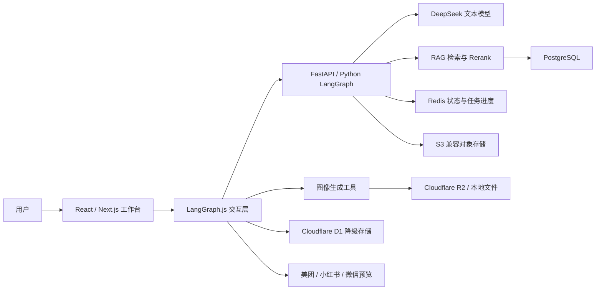
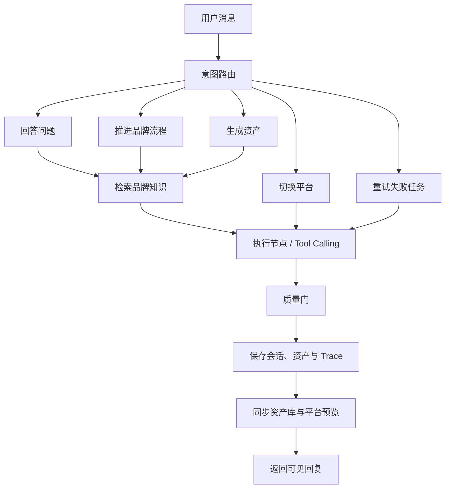
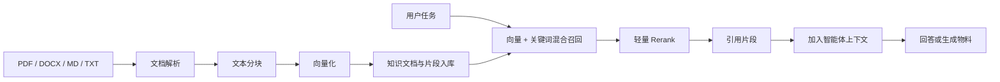

# SPECTRUM 系统架构

## 1. 目标

SPECTRUM 不是单纯的生图页面，而是一套从品牌信息采集、视觉规范建立到跨平台
物料交付的智能体工作台。系统需要同时满足：

- 用户可以随时提问、纠错、重试或切换平台
- 生成物必须继承同一套品牌定位、色彩、字体和 Logo
- 每生成一个资产，品牌资产库与平台预览同步更新
- 品牌资料可以被检索、引用和验证
- AI 或外部工具失败时，不丢失会话状态

## 2. 总体架构

## 3. 智能体运行图

## 4. 关键状态

单个会话包含以下信息：

- 品牌主体：个人、店铺或产品
- 品牌名称、品类、定位和视觉风格
- 当前流程阶段和当前预览平台
- 已生成资产及其类型、尺寸、URL、Prompt 版本
- 用户与智能体消息
- 美团、小红书、微信各平台完成进度
- 最近一次失败任务及重试上下文
- 每一轮运行的 Trace 和质量检查结果

## 5. RAG 数据流

本地没有外部 Embedding 服务时，系统使用可复现的本地向量，确保测试和演示不依赖
额外付费服务。生产环境可切换为外部 Embedding API。

## 6. 数据与存储

| 数据 | 主要存储 | 降级方案 |
| --- | --- | --- |
| 用户、品牌、会话 | PostgreSQL | Cloudflare D1 / 本地 JSON |
| 短期状态、缓存、任务进度 | Redis | 进程内缓存 |
| 图片与上传文档 | S3 兼容对象存储 | R2 / 本地文件 |
| 知识文档与分块 | PostgreSQL | SQLite |
| Trace 与质量结果 | PostgreSQL / D1 | 会话 JSON |

## 7. 稳定性设计

- Python 服务调用设置超时，并在不可用时回退到 TypeScript 路由
- 生成失败不会伪造资产，也不会推进完成进度
- 会话先写入用户消息，再执行路由和工具，避免用户输入消失
- 重试任务沿用原品牌上下文，不要求用户重复描述
- 质量门验证资产类型、品牌令牌、持久化和预览同步
- 确定性测试不调用真实模型，避免外部额度影响回归结果

## 8. 当前边界

- 线上 Python、PostgreSQL、Redis 尚未部署
- 当前是多节点单智能体编排，不宣称为真正的多智能体系统
- Rerank 为轻量实现，生产环境可替换为专用模型
- Render、S3 和完整监控配置已经准备，但未作为当前本地 MVP 的验收条件
